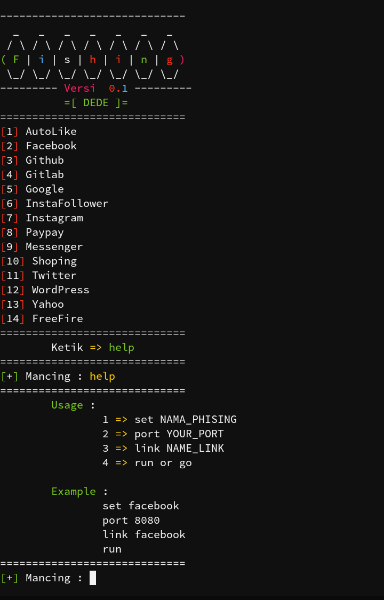
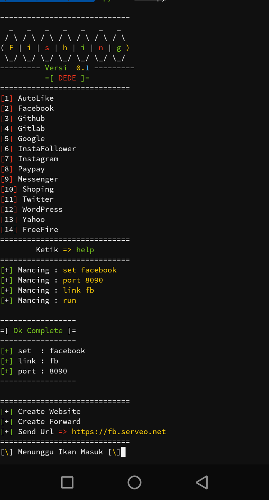
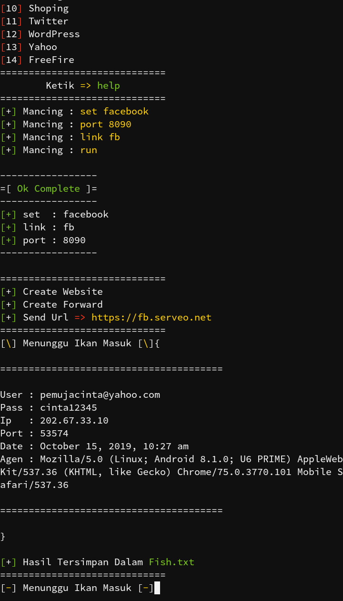

# Fish
```
Phising In Termux
```

# Install
```
apt update && apt upgrade -y
apt install php
apt install curl
apt install unzip
apt install python
pip install --upgrade pip
pip install requests
apt install apache2
apt install openssh
git clone https://github.com/TermuxArt/Fish
cd Fish
ls
unzip Fish.zip
python fish.py
```

# Image

<br />
<br />
<br />
<br />
